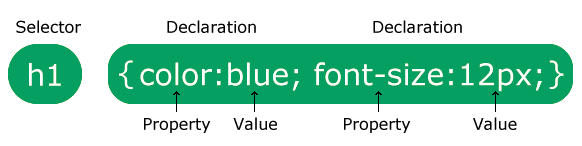
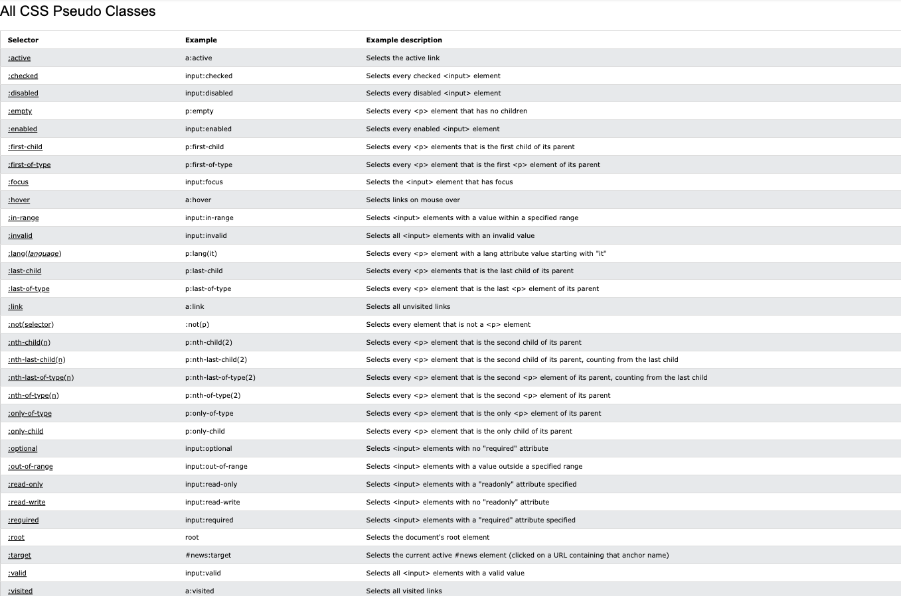
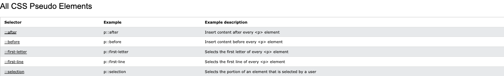

<div align = "center">
  
</div>

<hr>

## Table of Contents

- [What is CSS?](#what-is-css)
- [CSS Solved a Big Problem](#css-solved-a-big-problem)
- [CSS Syntax](#css-syntax)
- [CSS Selector](#css-selector)
  - [Simple](#simple)
  - [Combinator](#combinator)
    - [<u>Descendant Selector</u>](#udescendant-selectoru)
    - [<u>Child Selector (>)</u>](#uchild-selector-u)
    - [<u>Adjacent Sibling Selector (+)</u>](#uadjacent-sibling-selector-u)
    - [<u>General Sibling Selector (~)</u>](#ugeneral-sibling-selector-u)
  - [Pseudo-classes](#pseudo-classes)
  - [Pseudo-elements](#pseudo-elements)
    - [The ::first-letter Pseudo-element](#the-first-letter-pseudo-element)
    - [Pseudo-elements and HTML Classes](#pseudo-elements-and-html-classes)
    - [Multiple Pseudo-elements](#multiple-pseudo-elements)
    - [The ::before Pseudo-element](#the-before-pseudo-element)
    - [The ::after Pseudo-element](#the-after-pseudo-element)
    - [The ::marker Pseudo-element](#the-marker-pseudo-element)
    - [The ::selection Pseudo-element](#the-selection-pseudo-element)
  - [Attribute](#attribute)
    - [CSS [attribute="value"] Selector](#css-attributevalue-selector)
    - [CSS [attribute~="value"] Selector](#css-attributevalue-selector-1)
    - [CSS [attribute|="value"] Selector](#css-attributevalue-selector-2)
    - [CSS [attribute^="value"] Selector](#css-attributevalue-selector-3)
    - [CSS [attribute$="value"] Selector](#css-attributevalue-selector-4)
    - [CSS [attribute\*="value"] Selector](#css-attributevalue-selector-5)
- [How To Add CSS](#how-to-add-css)
  - [Three Ways to Insert CSS](#three-ways-to-insert-css)
  - [External CSS](#external-css)
  - [Internal CSS](#internal-css)
  - [Inline CSS](#inline-css)
  - [Multiple Style Sheets](#multiple-style-sheets)
  - [Cascading Order](#cascading-order)
- [CSS Properties](#css-properties)
  - [CSS clip-path Property](#css-clip-path-property)
  - [CSS transform Property](#css-transform-property)
  - [CSS Gradients](#css-gradients)
  - [CSS @keyframes Rule](#css-keyframes-rule)
  - [CSS Anumations](#css-anumations)
  - [CSS backface-visibility](#css-backface-visibility)
  - [CSS box-shadow](#css-box-shadow)
- [More Advanced CSS Topics](#more-advanced-css-topics)
  - [What is the importance of the following piece of code](#what-is-the-importance-of-the-following-piece-of-code)
  - [Relationship of grid layout to other layout methods](https://developer.mozilla.org/en-US/docs/Web/CSS/CSS_grid_layout/Relationship_of_grid_layout_with_other_layout_methods)

# What is CSS?

CSS (Cascading Style Sheets) is the language we use to style an HTML document. It describes how HTML elements should be displayed, including variations in display for different devices and screen sizes.

# CSS Solved a Big Problem

HTML was NEVER intended to contain tags for formatting a web page!

HTML was created to describe the content of a web page, like:

```css
<h1>This is a heading</h1>
<p>This is a paragraph.</p>
```

When tags like `<font>`, and color attributes were added to the HTML 3.2 specification, it started a nightmare for web developers. Development of large websites, where fonts and color information were added to every single page, became a long and expensive process.

To solve this problem, the World Wide Web Consortium (W3C) created CSS.

CSS removed the style formatting from the HTML page.

The style definitions are normally saved in external `.css` files.

With an external stylesheet file, you can change the look of an entire website by changing just one file!

# CSS Syntax

A CSS rule consists of a selector and a declaration block.

<div align="center">
  
</div>

The selector points to the HTML element you want to style.

The declaration block, which are surrounded by curly braces, contains one or more declarations separated by semicolons.

Each declaration includes a CSS property name and a value, separated by a colon.

In this example all `<p>` elements will be center-aligned, with a red text color:

```css
p {
  color: red;
  text-align: center;
}
```

Example Explained

- `p` is a selector in CSS (it points to the HTML element you want to style: `<p>`)
- `color` is a property, and `red` is the property value
- `text-align` is a property, and `center` is the property value

# CSS Selector

CSS selectors are used to "find" (or select) the HTML elements you want to style.

We can divide CSS selectors into five categories:

## Simple

Select elements based on class name, id, class

In this example all `<div>` elements will be set with a background color red:

```css
div {
  background: red;
}
```

The <u>**_Id Selector_**</u> uses the id attribute of an HTML element to select a specific element.

The id of an element is unique within a page, so the id selector is used to select one unique element.

To select an element with a specific id, write a hash `(#)` character, followed by the id of the element.

The CSS rule below will be applied to the HTML element with `id="para1"`:

```css
#para1 {
  text-align: center;
  color: red;
}
```

The <u>**_Class Selector_**</u> selects HTML elements with a specific class attribute.

To select elements with a specific class, write a period `(.)` character, followed by the class name.

In this example all HTML elements with class="center" will be red and center-aligned:

```css
.center {
  text-align: center;
  color: red;
}
```

You can also specify that only specific HTML elements should be affected by a class.

In this example only `<p>` elements with class="center" will be red and center-aligned:

```css
p.center {
  text-align: center;
  color: red;
}
```

HTML elements can also refer to more than one class.

In this example the `<p>` element will be styled according to class="center" and to class="large":

```css
  <p class="center large">This paragraph refers to two classes.</p>
```

The <u>**_Universal Selector (\*)_**</u> selects all HTML elements on the page.

The CSS rule below will affect every HTML element on the page:

```css
* {
  text-align: center;
  color: blue;
}
```

The <u>**_Grouping Selector_**</u> selects all the HTML elements with the same style definitions.

Look at the following CSS code (the h1, h2, and p elements have the same style definitions):

```css
h1 {
  text-align: center;
  color: red;
}

h2 {
  text-align: center;
  color: red;
}

p {
  text-align: center;
  color: red;
}
```

It will be better to group the selectors, to minimize the code.

To group selectors, separate each selector with a comma.

In this example we have grouped the selectors from the code above:

```css
h1,
h2,
p {
  text-align: center;
  color: red;
}
```

## Combinator

Select elements based on a specific relationship between them.

A CSS selector can contain more than one simple selector. Between the simple selectors, we can include a combinator.

There are four different combinators in CSS:

1. Desdcendant selector (space)
2. Child selector (>)
3. Adjacent sibling selector (+)
4. General sibling selector (~)

### <u>Descendant Selector</u>

The descendant selector matches all elements that are descendants of a specified element.

The following example selects all `<p>` elements inside `<div>` elements:

```css
div p {
  background-color: yellow;
}
```

### <u>Child Selector (>)</u>

The child selector selects all elements that are the children of a specified element.

The following example selects all `<p>` elements that are children of a `<div>` element:

```css
div > p {
  background-color: yellow;
}
```

### <u>Adjacent Sibling Selector (+)</u>

The adjacent sibling selector is used to select an element that is directly after another specific element.

Sibling elements must have the same parent element, and _"adjacent"_ means _"immediately following"_.

The following example selects the first `<p>` element that are placed immediately after `<div>` elements:

```css
div + p {
  background-color: yellow;
}
```

### <u>General Sibling Selector (~)</u>

The general sibling selector selects all elements that are next siblings of a specified element.

The following example selects all `<p>` elements that are next siblings of `<div>` elements:

```css
div ~ p {
  background-color: yellow;
}
```

## Pseudo-classes

A pseudo-class is used to define a special state of an element.

For example, it can be used to:

1. Style an element when a user mouses over it
2. Style visited and unvisited links differently
3. Style an element when it gets focus

The syntax of pseudo-classes:

```css
selector:pseudo-class {
  property: value;
}
```

Links can be displayed in different ways:

```css
/* unvisited link */
a:link {
  color: #ff0000;
}

/* visited link */
a:visited {
  color: #00ff00;
}

/* mouse over link */
a:hover {
  color: #ff00ff;
}

/* selected link */
a:active {
  color: #0000ff;
}
```

_Note: `a:hover` MUST come after `a:link` and a:visited in the CSS definition in order to be effective! `a:active` MUST come after `a:hover` in the CSS definition in order to be effective! Pseudo-class names are not case-sensitive._

Pseudo-classes can be combined with HTML classes:

When you hover over the link in the example, it will change color:

```css
a.highlight:hover {
  color: #ff0000;
}
```

An example of using the `:hover` pseudo-class on a `<div>` element:

```css
div:hover {
  background-color: blue;
}
```

Hover over a `<div>` element to show a `<p>` element (like a tooltip):

```css
p {
  display: none;
  background-color: yellow;
  padding: 20px;
}

div:hover p {
  display: block;
}
```

The `:first-child` pseudo-class matches a specified element that is the first child of another element.

In the following example, the selector matches any <p> element that is the first child of any element:

```css
p:first-child {
  color: blue;
}
```

In the following example, the selector matches the first `<i>` element in all `<p>` elements:

```css
p i:first-child {
  color: blue;
}
```

In the following example, the selector matches all `<i>` elements in `<p>` elements that are the first child of another element:

```css
p:first-child i {
  color: blue;
}
```

<div align="center">
  
</div>

## Pseudo-elements

A CSS pseudo-element is used to style specified parts of an element.

For example, it can be used to:

1. Style the first letter, or line, of an element
2. Insert content before, or after, the content of an element

The syntax of pseudo-elements:

```css
selector::pseudo-element {
  property: value;
}
```

The `::first-line` pseudo-element is used to add a special style to the first line of a text.

The following example formats the first line of the text in all `<p>` elements:

```css
p::first-line {
  color: #ff0000;
  font-variant: small-caps;
}
```

_Note: The `::first-line` pseudo-element can only be applied to block-level elements._

The following properties apply to the ::first-line pseudo-element:

- font spacing
- color properties
- background properties
- word-spacing
- letter-spacing
- text-decoration
- vertical-align
- text-transform
- line-height
- clear

```txt
Notice the double colon notation - ::first-line versus :first-line

The double colon replaced the single-colon notation for pseudo-elements in CSS3. This was an attempt from W3C to distinguish between pseudo-classes and pseudo-elements.

The single-colon syntax was used for both pseudo-classes and pseudo-elements in CSS2 and CSS1.

For backward compatibility, the single-colon syntax is acceptable for CSS2 and CSS1 pseudo-elements.
```

### The ::first-letter Pseudo-element

The `::first-letter` pseudo-element is used to add a special style to the first letter of a text.

The following example formats the first letter of the text in all `<p>` elements:

```css
p::first-letter {
  color: #ff0000;
  font-size: xx-large;
}
```

```txt
Note: The ::first-letter pseudo-element can only be applied to block-level elements.

The following properties apply to the ::first-letter pseudo- element:

    font properties
    color properties
    background properties
    margin properties
    padding properties
    border properties
    text-decoration
    vertical-align (only if "float" is "none")
    text-transform
    line-height
    float
    clear
```

### Pseudo-elements and HTML Classes

Pseudo-elements can be combined with HTML classes:

```css
p.intro::first-letter {
  color: #ff0000;
  font-size: 200%;
}
```

The example above will display the first letter of paragraphs with class="intro", in red and in a larger size.

### Multiple Pseudo-elements

Several pseudo-elements can also be combined.

In the following example, the first letter of a paragraph will be red, in an xx-large font size. The rest of the first line will be blue, and in small-caps. The rest of the paragraph will be the default font size and color:

```css
p::first-letter {
  color: #ff0000;
  font-size: xx-large;
}

p::first-line {
  color: #0000ff;
  font-variant: small-caps;
}
```

### The ::before Pseudo-element

The `::before` pseudo-element can be used to insert some content before the content of an element.

The following example inserts an image before the content of each `<h1>` element:

```css
h1::before {
  content: url(smiley.gif);
}
```

### The ::after Pseudo-element

The `::after` pseudo-element can be used to insert some content after the content of an element.

The following example inserts an image after the content of each `<h1>` element:

```css
h1::after {
  content: url(smiley.gif);
}
```

### The ::marker Pseudo-element

The `::marker` pseudo-element selects the markers of list items.

The following example styles the markers of list items:

```css
::marker {
  color: red;
  font-size: 23px;
}
```

### The ::selection Pseudo-element

The `::marker` pseudo-element selects the markers of list items.

The `::selection` pseudo-element matches the portion of an element that is selected by a user.

The following CSS properties can be applied to `::selection`: `color`, `background`, `cursor`, and `outline`.

The following example makes the selected text red on a yellow background:

```css
::selection {
  color: red;
  background: yellow;
}
```

<div align="center">
  
</div>

## Attribute

The `[attribute]` selector is used to select elements with a specified attribute.

The following example selects all `<a>` elements with a target attribute:

```css
a[target] {
  background-color: yellow;
}
```

#### CSS [attribute="value"] Selector

The `[attribute="value"]` selector is used to select elements with a specified attribute and value.

The following example selects all `<a>` elements with a `target="_blank"` attribute:

```css
a[target="_blank"] {
  background-color: yellow;
}
```

#### CSS [attribute~="value"] Selector

The `[attribute~="value"]` selector is used to select elements with an attribute value containing a specified word.

The following example selects all elements with a title attribute that contains a space-separated list of words, one of which is "flower":

```css
[title~="flower"] {
  border: 5px solid yellow;
}
```

The example above will match elements with title="flower", title="summer flower", and title="flower new", but not title="my-flower" or title="flowers".

#### CSS [attribute|="value"] Selector

The `[attribute|="value"]` selector is used to select elements with the specified attribute, whose value can be exactly the specified value, or the specified value followed by a hyphen (-).

Note: The value has to be a whole word, either alone, like class="top", or followed by a hyphen( - ), like class="top-text".

```css
[class|="top"] {
  background: yellow;
}
```

#### CSS [attribute^="value"] Selector

The `[attribute^="value"]` selector is used to select elements with the specified attribute, whose value starts with the specified value.

The following example selects all elements with a class attribute value that starts with "top":

Note: The value does not have to be a whole word!

```css
[class^="top"] {
  background: yellow;
}
```

#### CSS [attribute$="value"] Selector

The `[attribute$="value"]` selector is used to select elements whose attribute value ends with a specified value.

The following example selects all elements with a class attribute value that ends with "test":

Note: The value does not have to be a whole word!

```css
[class$="test"] {
  background: yellow;
}
```

#### CSS [attribute*="value"] Selector

The `[attribute*="value"]` selector is used to select elements whose attribute value contains a specified value.

The following example selects all elements with a class attribute value that contains "te":

Note: The value does not have to be a whole word!

```css
[class*="te"] {
  background: yellow;
}
```

# How To Add CSS

When a browser reads a style sheet, it will format the HTML document according to the information in the style sheet.

## Three Ways to Insert CSS

There are three ways of inserting a style sheet:

- External CSS
- Internal CSS
- Inline CSS

## External CSS

With an external style sheet, you can change the look of an entire website by changing just one file!

Each HTML page must include a reference to the external style sheet file inside the `<link>` element, inside the head section.

```html
<!DOCTYPE html>
<html>
  <head>
    <link rel="stylesheet" href="mystyle.css" />
  </head>
  <body>
    <h1>This is a heading</h1>
    <p>This is a paragraph.</p>
  </body>
</html>
```

An external style sheet can be written in any text editor, and must be saved with a .css extension.

The external `.css` file should not contain any HTML tags.

Here is how the `"mystyle.css"` file looks:

```css
body {
  background-color: lightblue;
}

h1 {
  color: navy;
  margin-left: 20px;
}
```

```txt
Note: Do not add a space between the property value and the unit:
  Incorrect (space): margin-left: 20 px;
  Correct (nospace): margin-left: 20px;
```

## Internal CSS

An internal style sheet may be used if one single HTML page has a unique style.

The internal style is defined inside the `<style>` element, inside the head section.

Internal styles are defined within the `<style>` element, inside the `<head>` section of an HTML page:

```html
<!DOCTYPE html>
<html>
  <head>
    <style>
      body {
        background-color: linen;
      }

      h1 {
        color: maroon;
        margin-left: 40px;
      }
    </style>
  </head>
  <body>
    <h1>This is a heading</h1>
    <p>This is a paragraph.</p>
  </body>
</html>
```

## Inline CSS

An inline style may be used to apply a unique style for a single element.

To use inline styles, add the style attribute to the relevant element. The style attribute can contain any CSS property.

Inline styles are defined within the "style" attribute of the relevant element:

```html
<!DOCTYPE html>
<html>
  <body>
    <h1 style="color:blue;text-align:center;">This is a heading</h1>
    <p style="color:red;">This is a paragraph.</p>
  </body>
</html>
```

## Multiple Style Sheets

If some properties have been defined for the same selector (element) in different style sheets, the value from the last read style sheet will be used.

Assume that an **external style sheet** has the following style for the `<h1>` element:

```css
h1 {
  color: navy;
}
```

Then, assume that an **internal style sheet** also has the following style for the `<h1>` element:

```css
h1 {
  color: orange;
}
```

If the internal style is defined **after** the link to the external style sheet, the `<h1>` elements will be `"orange"`:

```html
<head>
  <link rel="stylesheet" type="text/css" href="mystyle.css" />
  <style>
    h1 {
      color: orange;
    }
  </style>
</head>
```

However, if the internal style is defined **before** the link to the external style sheet, the `<h1>` elements will be `"navy"`:

```html
<head>
  <style>
    h1 {
      color: orange;
    }
  </style>
  <link rel="stylesheet" type="text/css" href="mystyle.css" />
</head>
```

## Cascading Order

What style will be used when there is more than one style specified for an HTML element?

All the styles in a page will "cascade" into a new "virtual" style sheet by the following rules, where number one has the highest priority:

1. Inline style (inside an HTML element)
2. External and internal style sheets (in the head section)
3. Browser default

So, an inline style has the highest priority, and will override external and internal styles and browser defaults.

# CSS Properties

## CSS clip-path Property

https://www.w3schools.com/cssref/css3_pr_clip-path.asp

## CSS transform Property

https://www.w3schools.com/cssref/css3_pr_transform.asp

## CSS Gradients

https://www.w3schools.com/css/css3_gradients.asp

## CSS @keyframes Rule

https://www.w3schools.com/cssref/css3_pr_animation-keyframes.asp

## CSS Anumations

https://www.w3schools.com/css/css3_animations.asp

## CSS backface-visibility

https://www.w3schools.com/cssref/css3_pr_backface-visibility.asp

## CSS box-shadow

https://www.w3schools.com/cssref/css3_pr_box-shadow.asp

# More Advanced CSS Topics

## What is the importance of the following piece of code?

```css
* {
  margin: 0;
  padding: 0;
  box-sizing: border-box;
}
```

Before understanding _box-sizing_ we have to understand _how the box model_ works:
**In CSS, elements are made out of the content box itself as well as the
padding the border and margin**. By default, _box-sixing_ is set to "content-box"
so, that means that when we give something a width or height we're not setting the
size of the element, we're setting the size of the context box.

If we set the _box-sizing_ to _border-box_, we are changing the box-model so it
is included the padding, border and the margin within the specified width and
height of the element.

Overall, these initial styles help establish predictable layout for your web
page, which indeed is going to be easier to control.

- [Inheriting box-sizing Probably Slightly Better Best-Practice](https://css-tricks.com/inheriting-box-sizing-probably-slightly-better-best-practice/)
